# Metal Sketch Dojo

## Graphics and animations with the Apple Metal API

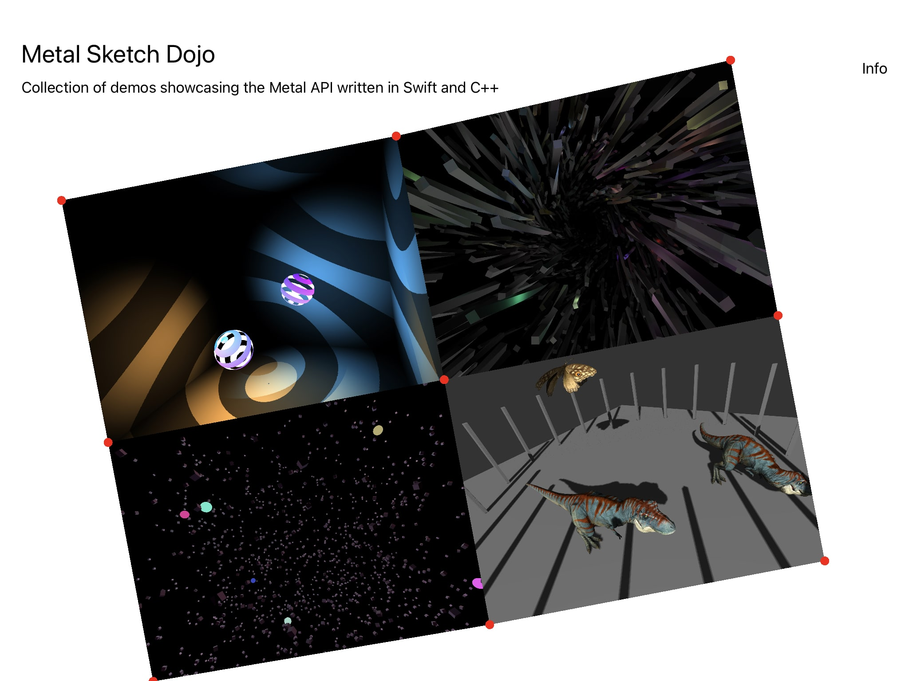
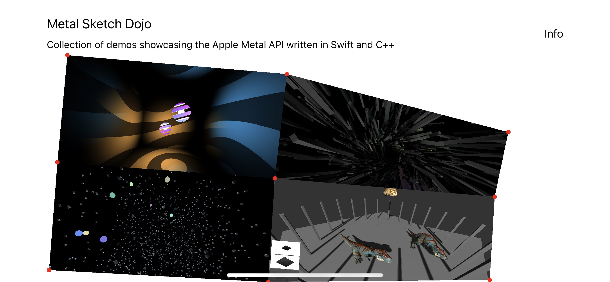

### Table of contents

1. [Introduction](#1-introduction)
2. [App architecture](#2-app-architecture)
3. ["Point Light Casters" Demo](#3-point-light-casters)
   1. [Different spheres, same underlying shaders: Metal function constants](#31-different-spheres-same-underlying-shaders-metal-function-constants)
   2. [Cube shadows via depth cubemaps in a single drawcall](#32-cube-shadows-via-depth-cubemaps-in-a-single-drawcall)
   3. [Frame render graph](#33-frame-render-graph)
   4. [References and readings](#34-references-and-readings)
4. ["Infinite Space" Demo](#4-infinite-space)
   1. [Tile-Based Deferred Rendering](#41-tile-based-deferred-rendering)
   2. [Frame render graph](#42-frame-render-graph)
   3. [References and readings](#43-references-and-readings)
5. ["Apple Metal" Demo](#5-apple-metal)
   1. [Frame render graph](#51-frame-render-graph)
6. ["Skeleton animations and cascaded shadows" Demo](#6-skeleton-animations-and-cascaded-shadows)
   1. [Physically Based Rendering](#61-physically-based-rendering)
   2. [Skeleton animations](#62-skeleton-animations)
   3. [Cascaded shadow mapping (CSM)](#63-cascaded-shadow-mapping-csm)
   4. [Frame render graph](#64-frame-render-graph)
   5. [References and readings](#65-references-and-readings)
   6. [Models used](#66-models-used)

### 1. Introduction

This is my first iOS app and a playground for me to explore Swift and the Apple Metal rendering API.

This project has no external libraries: all animations, physics and graphics are written from scratch. I worked on it in my spare time for almost 2 months, learning a ton about Swift, Metal and different rendering techniques in the process. For studying I used these resources (in the following order):

- [Hacking with Swift](https://www.hackingwithswift.com/)
- [Expert Swift](https://www.kodeco.com/books/expert-swift)
- [SwiftUI Apprentice](https://www.kodeco.com/books/swiftui-apprentice)
- [Metal by Tutorials](https://www.kodeco.com/books/metal-by-tutorials)

Coming from web development with Javascript and WebGL / WebGPU, this project was really fun to do as my first iOS app.

### 2. App architecture

The app is made up by two layers:

1. Very thin SwiftUI UI layer, compromising mostly of buttons and text
2. A Metal view responsible for drawing the graphics and animation and also capturing and reacting to user inputs such as clicks and dragging.

These two layers communicate with each other by using [published properties](https://www.hackingwithswift.com/quick-start/swiftui/what-is-the-published-property-wrapper) via Combine's `ObservableObject` which acts as a central dispatcher and automatically announces when changes to its properties have occured.

Let's assume that this object definition looks like this:

```swift
class Options: ObservableObject {
	@Published var activeProjectName: String = WelcomeScreen.SCREEN_NAME
}
```

A good example would be:

1. The user clicks on the homescreen menu drawn by the Metal layer, bounding box detection is performed and the correct demo to be opened is determined.
2. The Metal layer opens the demo with an animation and dispatches the name of the clicked demo as a string to `activeProjectName` property inside `Options`.
3. The SwiftUI layer observes the change of `activeProjectName` inside the `ObservableObject` and displays the demo name, "Back" and "Demo Info" buttons on top with a subtle animation.
4. When the user clicks on the "Back" button inside the SwiftUI layer, the `activeProjectName` is set to `nil` inside the `ObservableObject`. This change is observed by the Metal layer which closes down the active demo with an animation.

And here are these steps visualised:

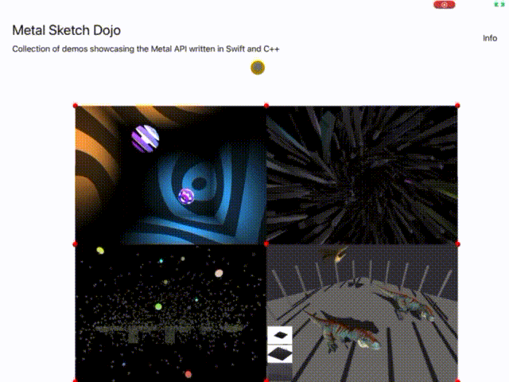

---

### 3. Point Light Casters


##### [Open in Youtube](https://www.youtube.com/watch?v=QPfK8xAckAw&ab_channel=GeorgiNikoloff)

The visuals of this demo are borrowed from [this Threejs example](https://threejs.org/examples/?q=point#webgl_shadowmap_pointlight). I really like the interplay of shadows and lights so was curious to implement it via the Metal API.

It renders a cube with front face culling enabled and two shadow casters represented by cut off spheres.

#### 3.1. Different spheres, same underlying shaders: Metal function constants

Metal has no preprocessor directives, rather it uses [function constants](https://developer.apple.com/documentation/metal/mtlfunctionconstantvalues) to permutate a graphics or a compute function. Since Metal shaders are precompiled, different permutations do not result in different binaries, rather things are lazily turned on or off conditionally upon shader pipeline creation.

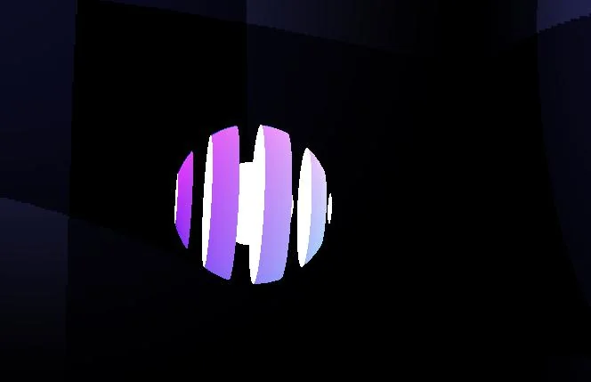

The sphere above is made of three drawcalls, using three different pipelines backed by the same vertex and fragment shaders. Each pipeline permutation has different inputs / outputs and codepaths toggled by function constants:

1. **Front part of the sphere** - has a gradient as color and is cut-off along the Y axis
2. **Back side of the sphere** - has a solid white as color and is cut-off along the Y axis
3. **Center part** - another sphere with a solid white as color and no cut-off

The function constants look like this:

```c++
constant bool is_sphere_back_side [[function_constant(0)]];
constant bool is_shaded_and_shadowed [[function_constant(1)]];
constant bool is_cut_off_alpha [[function_constant(2)]];
```

Later on in the shader code these values can be used to achieve the different spheres look. For example, to cutoff a sphere the code might look like this:

```c++
fragment float4 fragment_main() {
   // ...
   if (is_cut_off_alpha) {
      float a = computeOpacity(in.uv);
      if (a < 0.5) {
        discard_fragment();
      }
   }
}
```

#### 3.2. Cube shadows via depth cubemaps in a single drawcall

Point shadow casting is straightforward and hardly a new technique: we place a camera where the light should be, orient it to face left, right, top, bottom, forward and backwards, in the process rendering each of these views into the sides of a cube depth texture. We then use this cube texture in our main fragment shader to determine which pixels are in shadow and which ones are not. Nothin' that fancy.


The Metal API however makes things interesting by **allowing us to render all 6 sides of the cube texture in a single draw call**. It does so by utilising [layer selection](https://developer.apple.com/documentation/metal/render_passes/rendering_to_multiple_texture_slices_in_a_draw_command). It allows us to render to multiple layers (slices) of a textture array, 3d texture or a cube texture. We can choose a destination slice for each primitive in the vertex shader. So each sphere is rendered 6 times with a single draw call, each render using a different camera orientation and storing its result in the appropriate cube texture side.

#### 3.3. Frame render graph

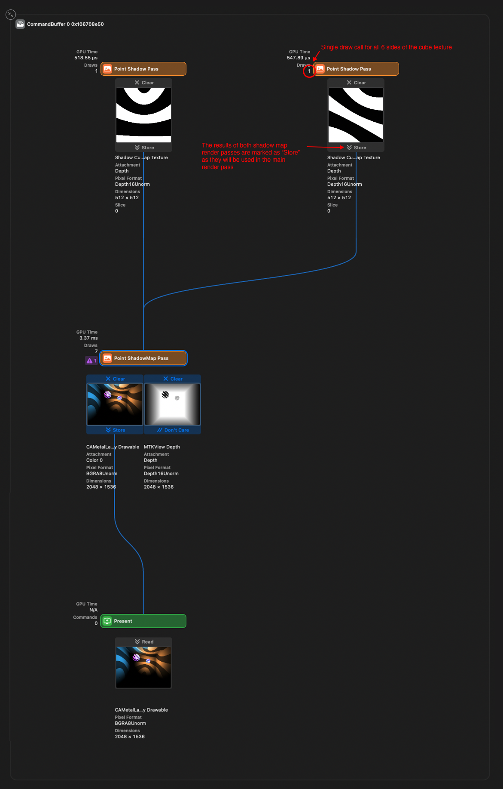

#### 3.4. References and readings

- [THREE.PointLight ShadowMap Demo](https://threejs.org/examples/?q=point#webgl_shadowmap_pointlight)
- [Rendering Reflections with Fewer Render Passes](https://developer.apple.com/documentation/metal/metal_sample_code_library/rendering_reflections_with_fewer_render_passes)
- [Learn OpenGL - Point Shadows](https://learnopengl.com/Advanced-Lighting/Shadows/Point-Shadows)

---

### 4. Infinite space

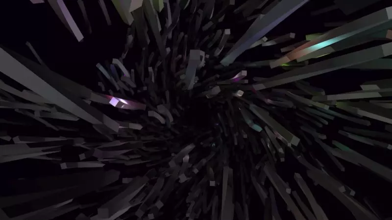

##### [Open in Youtube](https://www.youtube.com/watch?v=G13mUAIfcpg&ab_channel=GeorgiNikoloff)

This demo renders 3000 boxes lighted by 300 point lights. It uses compute shaders to animate the boxes / lights positions on the GPU and deferred rendering to decouple scene geometry complexity from shading. It takes advantage of [modern tile-based architecture](https://developer.apple.com/documentation/metal/tailor_your_apps_for_apple_gpus_and_tile-based_deferred_rendering) on Apple hardware. Each point light is represented as a solid colored sphere, rendered to the framebuffer with additive blending enabled.

#### 4.1. Tile-Based Deferred Rendering

In traditional deferred rendering we render our intermediate G-Buffer textures to video memory and fetch them at the final light accumulation pass.

However tile-based deferred rendering (TBDR) capable GPUs introduce the concept of tile memory:

> Tile memory is fast, temporary storage that resides on the GPU itself. After the GPU finishes rendering each tile into tile memory, it writes the final result to device memory.

Here is how it looks in Xcode debugger:

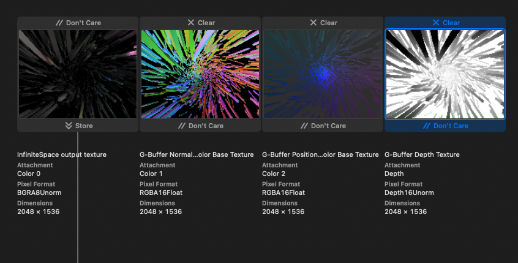

The three textures on the right are transient and stored in "tile memory" only. They are marked as `"Don't care"`, so they are discarded after the render pass is completed. The right one is the final render submitted to device memory (marked as `"Store"`). The textures on the right are written to and sampled from by the texture on the left all in the same pass!

From left to right we have the following G-Buffer textures:

1. G-Buffer output texture with `BGRA8Unorm` value. Storage mode is `Store`, as we want this texture stored in video memory in order to show it on the device screen.

2. Normal + Shininess + Base Color with `RGBA16Float` pixel format. Storage mode is `.memoryless` which marks it as transient and to be **stored in tile memory only**

   2.1. The normal is tightly packed into the first 2 `rg` channels and unpacked back into 3 channels in the final step

   2.2. Shininess is packed into the `b` channel

   2.3. And finally, the base color is encoded into the last `a` channel. You may ask yourself how can an RGB color be encoded into a single float and it is really not. Rather all of the boxes use the same float value for their RGB channels. Perhaps Color is not the best word here?

3. Position + Specular with `RGBA16Float` pixel format. Storage mode is `.memoryless` which marks it as transient and to be **stored in tile memory only**

   3.1. The XYZ position is encoded into the `rgb` components

   3.2. Specular into the remaining `a` component

4. Depth texture with `DepthUNorm` pixel format. Storage mode is `.memoryless` which marks it as transient and to be **stored in tile memory only**

Here is how they are created in Swift code:

```swift
outputTexture = Self.createOutputTexture(
  size: size,
  label: "InfiniteSpace output texture"
)
normalShininessBaseColorTexture = TextureController.makeTexture(
  size: size,
  pixelFormat: .rgba16Float,
  label: "G-Buffer Normal + Shininess + Color Base Texture",
  storageMode: .memoryless
)
positionSpecularColorTexture = TextureController.makeTexture(
  size: size,
  pixelFormat: .rgba16Float,
  label: "G-Buffer Position + Specular Color Base Texture",
  storageMode: .memoryless
)
depthTexture = TextureController.makeTexture(
  size: size,
  pixelFormat: .depth16Unorm,
  label: "G-Buffer Depth Texture",
  storageMode: .memoryless
)
```

#### 4.2. Frame render graph

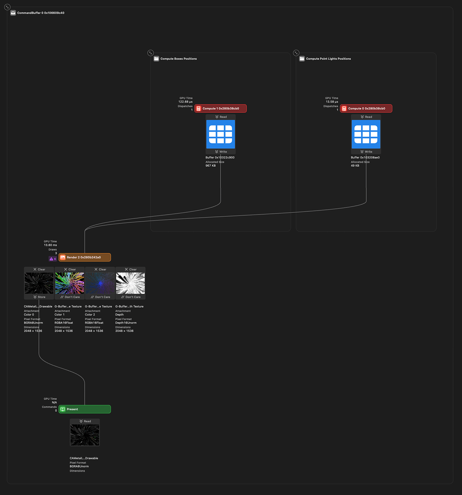

#### 4.3. References and readings

- [Metal Docs - Tile-Based Deferred Rendering](https://developer.apple.com/documentation/metal/tailor_your_apps_for_apple_gpus_and_tile-based_deferred_rendering)
- [The Arm Manga Guide to the Mali GPU](https://interactive.arm.com/story/the-arm-manga-guide-to-the-mali-gpu/page/1)
- [Compact Normal Storage for small G-Buffers](https://aras-p.info/texts/CompactNormalStorage.html)

---

### 5. "Apple Metal"

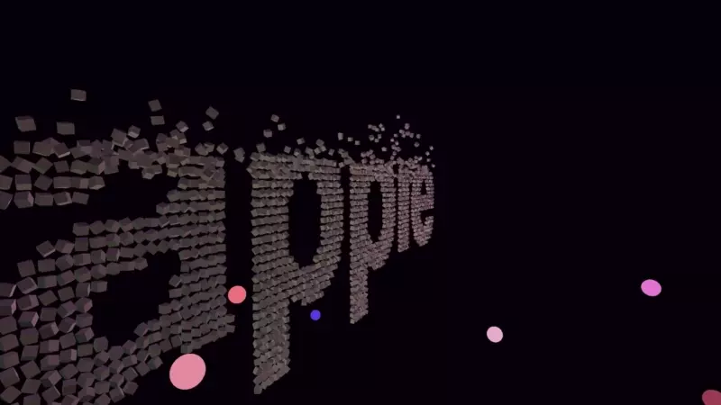

##### [Open in Youtube](https://www.youtube.com/watch?v=VLKNaHSXFYI&ab_channel=GeorgiNikoloff)

While this is arguably the easiest demo technically, I had the most fun creating it. It features particles with simple verlet physics and transitions between the words "APPLE" and "METAL". The particle and lights movement is animated on the GPU via compute shaders. The particles are colored by the lights via Phong shading.

The words particles positions were created by rendering text via the HTML5 [`<canvas />`](https://developer.mozilla.org/en-US/docs/Web/API/Canvas_API) API and scanning it's positions on a 2D grid and storing them in a Javascript arrays. The resulting 2D grid positions were exported from JS to Swift arrays.

#### 5.1. Frame render graph

[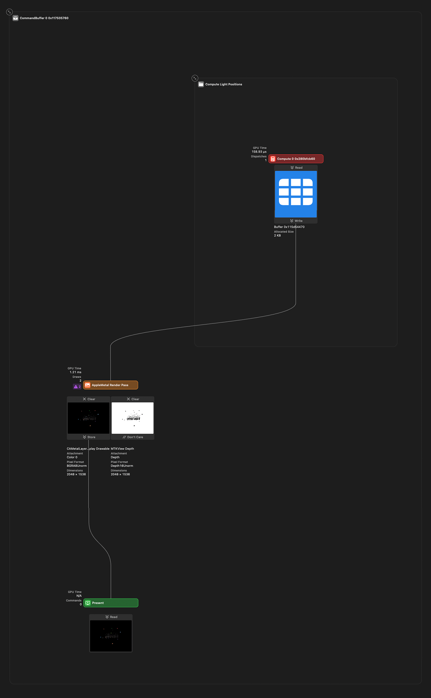](https://www.youtube.com/watch?v=VLKNaHSXFYI)

---

### 6. Skeleton animations and cascaded shadows

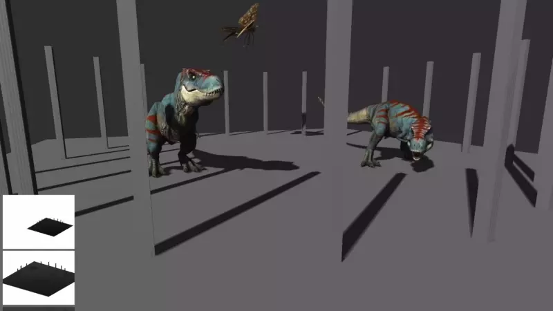

##### [Open in Youtube](https://www.youtube.com/watch?v=MmjMqpiy44U&ab_channel=GeorgiNikoloff)

#### 6.1. Physically Based Rendering

This demo features directional lighting and a PBR surface model, albeit mostly copy-pasted from LearnOpenGL and ported to the Metal Shading Language. The models are loaded and parsed from USDZ files and the appropriate textures are used in each step of the lighting equations.

#### 6.2. Skeleton animations

The skeleton animations for each model are loaded and can be mixed, played at different speeds etc.

#### 6.3. Cascaded shadow mapping (CSM)

CSM is an upgrade to traditional shadow mapping and addresses its few shortcommings, mainly the fact that it is difficult for the rendering distance to be large (think open world games for example), due to the limited shadow texture resolution size. As the rendering distance gets larger, increase in the shadow texture size is required, otherwise shadows gets less precise and more blocky. A shadow texture resolution can realistically be increased only so much on modern day hardware, especially mobile, so a better solution is needed.

CSM is a direct answer to that. The core insight is that we do not need the same amount of shadow detail for things that are far away from us. We want crisp shadows for stuff that’s near to the near plane, and we are absolutely fine with blurriness for objects that are hundreds of units away: it’s not going to be noticeable at all.

To do that, we divide our camera frustum into N sub-frustums and for each sub-frustum render a shadow map as seen from the light point of view. Send the resulting shadow map textures to the fragment shader and sample from the correct shadow map texture using the fragment depth value.

The scene in this demo is separated into three sections:

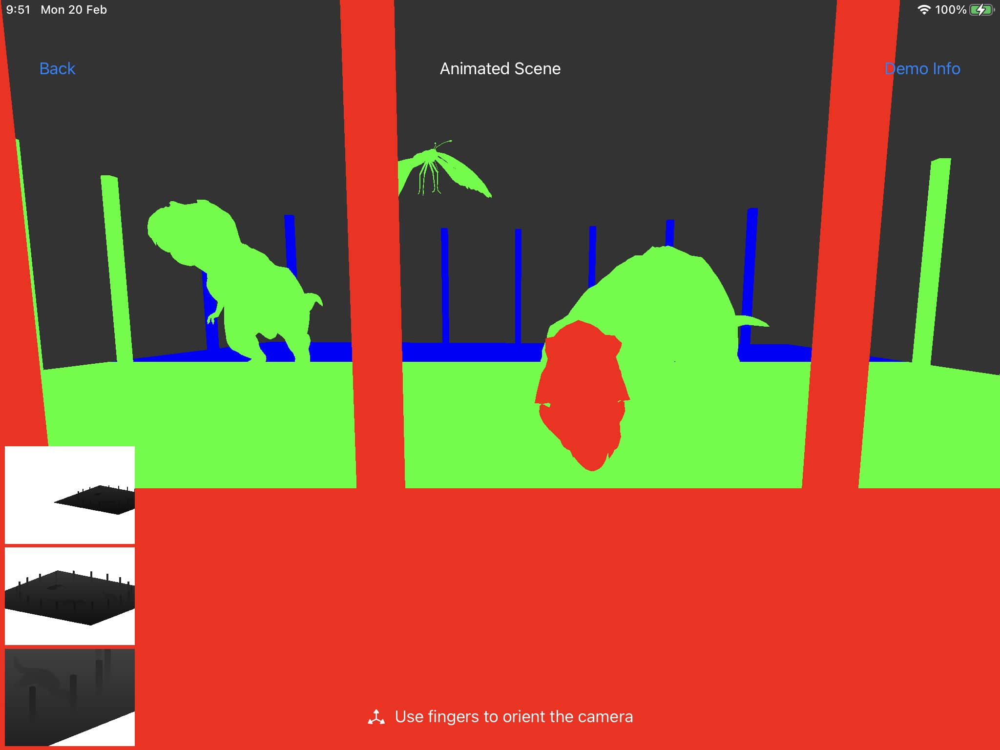

The red section will get the best shadow quality as it's nearest to the viewer camera. Next is green and then blue: these two levels will get progressively less shadow detail as they are further away.

You may have noticed the 3 shadow textures displayed in the bottom left for debugging purposes. Here is a better view of them:


The whole scene is rendered into three separate shadow map textures. The trick here is the same as in the first demo - we are able to render the whole scene into the 3 different texture slices in a single draw call via Metal layer selection. We can select with CSM shadow cascade to render to in dynamically in the vertex shader.

#### 6.4. Frame render graph

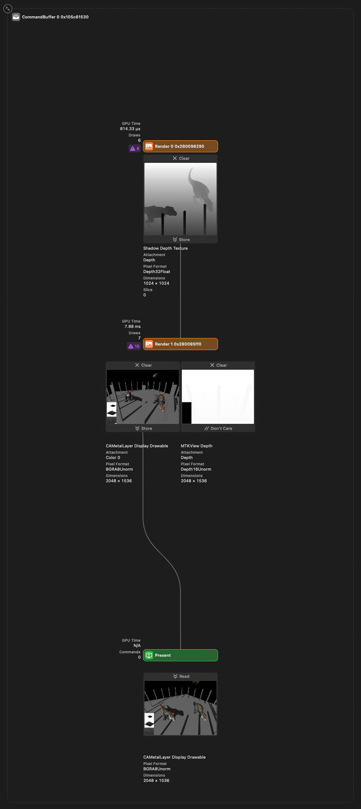

#### 6.5. References and readings

- [WebGPU Cascaded Shadow Maps](https://github.com/toji/webgpu-shadow-playground)
- [Rendering Reflections with Fewer Render Passes](https://developer.apple.com/documentation/metal/metal_sample_code_library/rendering_reflections_with_fewer_render_passes)
- [Learn OpenGL - Physically Based Rendering](https://learnopengl.com/PBR/Theory)
- [Learn OpenGL - Cascaded Shadow Mapping](https://learnopengl.com/Guest-Articles/2021/CSM)

#### 6.6. Models used

- [Junonia Lemonias Butterfly Rigged](https://sketchfab.com/3d-models/junonia-lemonias-butterfly-rigged-d912ff1fcd0e477c8a84e08ec280377a)
- [Animated T-Rex Dinosaur Biting Attack Loop](https://sketchfab.com/3d-models/animated-t-rex-dinosaur-biting-attack-loop-5bbcadb7d9274843abb5ada35767dba1)
